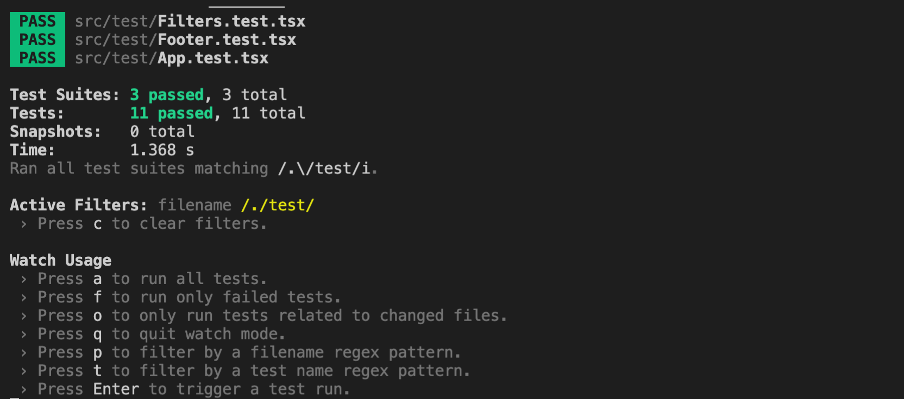

# Sprint 2 - Summary of tasks achieved

## UI Tasks achieved
- Integrated user api to register a user
- Integrated api to validate user details
- Created register page
- Created login lage
- Create my account page to display user details
- Wrote automation tests using cypress to test registration and login
- Wrote unit tests using jest to test registration and login

## Backend Tasks achieved
- Go lang Unit tests for User rest apis
- Go lang Unit tests for Listing rest apis
- Go lang Unit tests for Lease rest apis
- Go lang Unit tests for Apartment rest apis
- Added CORS policy in backend to allow cross origin requests
- Modified the endpoints to better api names
- Documented the new heroku rest api's
- Deployed our application in heroku so that everyone in the team can test our application

## Useful links of the project
- [Easy-Lease Repo Link](https://github.com/rahulvemula/SE-leasingPortal) 
- [Discussions link on git](https://github.com/rahulvemula/SE-leasingPortal/discussions)
- [Actions link on git](https://github.com/rahulvemula/SE-leasingPortal/actions)
- [Sprint 2 User stories progress board link](https://github.com/rahulvemula/SE-leasingPortal/projects/2)
- [All user stories link](https://github.com/rahulvemula/SE-leasingPortal/issues)


## Sprint 2 Demo
[Link to video](https://youtu.be/uIOmdBOGxIw)

## Cypress automation tests Demo
[Link to video](https://youtu.be/E7KT6BTbTKc)
## Backend Demo
[Link to video](https://www.youtube.com/watch?v=71Yq5YIdw_A)

## Screenshots for unit tests

#### UI Components tests

#### Go lang unit tests


## Api documentation of backend services
### A collapsible section with markdown
<details>
  <summary>User API</summary>
  
  ### GET ALL USERS
  - [http://murmuring-earth-87031.herokuapp.com/users ](http://murmuring-earth-87031.herokuapp.com/users)
  ### GET USER BY EMAIL
  - [http://murmuring-earth-87031.herokuapp.com/users/{email}](http://murmuring-earth-87031.herokuapp.com/users/{email})
  ### CREATE A USER
  - [http://murmuring-earth-87031.herokuapp.com/users](http://murmuring-earth-87031.herokuapp.com/users)
  * Payload
  ``` json
   {
      "name":"vamsi",
      "email":"vbethamsetty@ufl.edu",
      "password": "vamsi"
   }
   ```
  ### UPDATE AN USER
  - [http://murmuring-earth-87031.herokuapp.com/users/{userId}](http://murmuring-earth-87031.herokuapp.com/users/{userId})
  * Payload
  ``` json
   {
      "name":"vamsi",
      "email":"vbethamsetty@ufl.edu",
      "password": "vamsi"
   }
   ```
  ### DELETE AN USER
  - [http://murmuring-earth-87031.herokuapp.com/users/{id}](http://murmuring-earth-87031.herokuapp.com/users/{id})
</details>
<details>
  <summary>Lease API</summary>
  
  ### GET  ALL LEASES
  - [http://murmuring-earth-87031.herokuapp.com/leases ](http://murmuring-earth-87031.herokuapp.com/leases)
  ### CREATE A LEASE
  - [http://murmuring-earth-87031.herokuapp.com/leases](http://murmuring-earth-87031.herokuapp.com/leases)
  * Payload
  ``` json
    {
        "listingId":1,
        "userId":"1",
        "leaseStartDate": "28 Jan",
        "leaseEndDate" : "14 Feb"
    }
   ```
  ### UPDATE A LEASE
  - [http://murmuring-earth-87031.herokuapp.com/leases/{leaseId}](http://murmuring-earth-87031.herokuapp.com/leases/{leaseId})
  * Payload
  ``` json
   {
        "listingId":1,
        "userId":"1",
        "leaseStartDate": "28 Jan",
        "leaseEndDate" : "14 Feb"
    }
   ```
  ### DELETE A LEASE
  - [http://murmuring-earth-87031.herokuapp.com/leases/{leaseId}](http://murmuring-earth-87031.herokuapp.com/leases/{leaseId})
</details>
<details>
  <summary>Apartment API</summary>
  
  ### GET ALL APARTMENTS
  - [http://murmuring-earth-87031.herokuapp.com/apartments ](http://murmuring-earth-87031.herokuapp.com/apartments)
  ### CREATE AN APARTMENT
  - [http://murmuring-earth-87031.herokuapp.com/apartments](http://murmuring-earth-87031.herokuapp.com/apartments)
  * Payload
  ``` json
    {
        "name":"",
        "address":"3800 SW",
        "amenities": "counter top, new appliances"
    }
   ```
  ### UPDATE AN APARTMENT
  - [http://murmuring-earth-87031.herokuapp.com/apartments/{apartmentId}](http://murmuring-earth-87031.herokuapp.com/apartments/{apartmentId})
  * Payload
  ``` json
   {
        "name":"",
        "address":"3800 SW",
        "amenities": "counter top, new appliances"
    }
   ```
  ### DELETE AN APARTNMENT
  - [http://murmuring-earth-87031.herokuapp.com/apartments/{apartmentId}](http://murmuring-earth-87031.herokuapp.com/apartments/{apartmentId})
</details>
<details>
  <summary>Listing API</summary>
  
  ### GET ALL LISTINGS
  - [http://murmuring-earth-87031.herokuapp.com/listings ](http://murmuring-earth-87031.herokuapp.com/listings)
  ### CREATE A LISTING
  - [http://murmuring-earth-87031.herokuapp.com/listings](http://murmuring-earth-87031.herokuapp.com/listings)
  * Payload
  ``` json
    {
        "listingType":"bedroom",
        "houseType":"1",
        "rent": 500,
        "userId": 1,
        "isleased": true
    }
   ```
  ### UPDATE A LISTING
  - [http://murmuring-earth-87031.herokuapp.com/listings/{listingId}](http://murmuring-earth-87031.herokuapp.com/listings/{listingId})
  * Payload
  ``` json
   {
        "listingType":"bedroom",
        "houseType":"1",
        "rent": 500,
        "userId": 1,
        "isleased": true
    }
   ```
  ### DELETE A LISTING
  - [http://murmuring-earth-87031.herokuapp.com/listings/{listingId}](http://murmuring-earth-87031.herokuapp.com/listing/{listingId})
</details>
