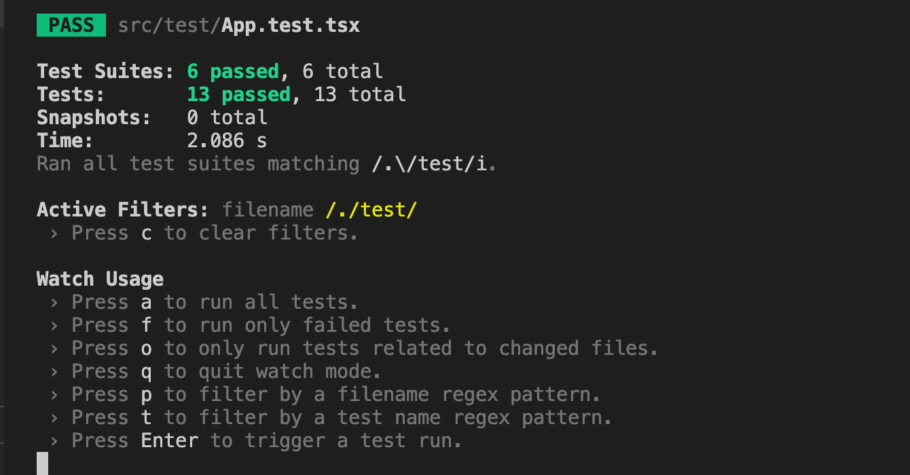

# Sprint 3 - Summary of tasks achieved

## UI Tasks achieved

- Added a property page for a user to be able to enter deatils and sign a lease
- Added route from listings page to property page to redirect when a particular property is selected
- Added a lease confirmation page to show lease details
- Added a feature to let user download lease document
- Added more unit tests and cypress tests
- Fixed failing unit tests

## Backend Tasks achieved

- Added JWT authrorization
- Integrated our Amazon S3 in our project to support block storage of images
- Included CRUD rest api's for the Society structure
- Added Unit tests for the Crud operations of Society class
- Included CRUD rest api's for the Complaint structure
- Added Unit tests for the Crud operations of Complaint class
- Setting up our project in Heroku to support CI/CD(in progress)


## Useful links of the project

- [Easy-Lease Repo Link](https://github.com/rahulvemula/SE-leasingPortal)
- [Discussions link on git](https://github.com/rahulvemula/SE-leasingPortal/discussions)
- [Actions link on git](https://github.com/rahulvemula/SE-leasingPortal/actions)
- [Sprint 3 User stories progress board link](https://github.com/rahulvemula/SE-leasingPortal/projects/3)
- [All user stories link](https://github.com/rahulvemula/SE-leasingPortal/issues)

## Sprint 3 Demo UI

[Link to video](https://youtu.be/1P5J-h7Prhs)

## Sprint 3 Demo backend

[Link to video](https://www.youtube.com/watch?v=VbkglHKMGxI)

## Cypress automation tests Demo

[Link to video](https://youtu.be/uM3tJRtxgXo)

## Screenshots for unit tests

#### UI Components tests



#### Go lang unit tests(with complaints and society tests added)


## Api documentation of backend services

### A collapsible section with markdown

<details>
  <summary>User API</summary>
  
  ### GET ALL USERS
  - [http://murmuring-earth-87031.herokuapp.com/users ](http://murmuring-earth-87031.herokuapp.com/users)
  ### GET USER BY EMAIL
  - [http://murmuring-earth-87031.herokuapp.com/users/{email}](http://murmuring-earth-87031.herokuapp.com/users/{email})
  ### CREATE A USER
  - [http://murmuring-earth-87031.herokuapp.com/users](http://murmuring-earth-87031.herokuapp.com/users)
  * Payload
  ``` json
   {
      "name":"vamsi",
      "email":"vbethamsetty@ufl.edu",
      "password": "vamsi"
   }
   ```
  ### UPDATE AN USER
  - [http://murmuring-earth-87031.herokuapp.com/users/{userId}](http://murmuring-earth-87031.herokuapp.com/users/{userId})
  * Payload
  ``` json
   {
      "name":"vamsi",
      "email":"vbethamsetty@ufl.edu",
      "password": "vamsi"
   }
   ```
  ### DELETE AN USER
  - [http://murmuring-earth-87031.herokuapp.com/users/{id}](http://murmuring-earth-87031.herokuapp.com/users/{id})
</details>
<details>
  <summary>Lease API</summary>
  
  ### GET  ALL LEASES
  - [http://murmuring-earth-87031.herokuapp.com/leases ](http://murmuring-earth-87031.herokuapp.com/leases)
  ### CREATE A LEASE
  - [http://murmuring-earth-87031.herokuapp.com/leases](http://murmuring-earth-87031.herokuapp.com/leases)
  * Payload
  ``` json
    {
        "listingId":1,
        "userId":"1",
        "leaseStartDate": "28 Jan",
        "leaseEndDate" : "14 Feb"
    }
   ```
  ### UPDATE A LEASE
  - [http://murmuring-earth-87031.herokuapp.com/leases/{leaseId}](http://murmuring-earth-87031.herokuapp.com/leases/{leaseId})
  * Payload
  ``` json
   {
        "listingId":1,
        "userId":"1",
        "leaseStartDate": "28 Jan",
        "leaseEndDate" : "14 Feb"
    }
   ```
  ### DELETE A LEASE
  - [http://murmuring-earth-87031.herokuapp.com/leases/{leaseId}](http://murmuring-earth-87031.herokuapp.com/leases/{leaseId})
</details>
<details>
  <summary>Apartment API</summary>
  
  ### GET ALL APARTMENTS
  - [http://murmuring-earth-87031.herokuapp.com/apartments ](http://murmuring-earth-87031.herokuapp.com/apartments)
  ### CREATE AN APARTMENT
  - [http://murmuring-earth-87031.herokuapp.com/apartments](http://murmuring-earth-87031.herokuapp.com/apartments)
  * Payload
  ``` json
    {
        "name":"",
        "address":"3800 SW",
        "amenities": "counter top, new appliances"
    }
   ```
  ### UPDATE AN APARTMENT
  - [http://murmuring-earth-87031.herokuapp.com/apartments/{apartmentId}](http://murmuring-earth-87031.herokuapp.com/apartments/{apartmentId})
  * Payload
  ``` json
   {
        "name":"",
        "address":"3800 SW",
        "amenities": "counter top, new appliances"
    }
   ```
  ### DELETE AN APARTNMENT
  - [http://murmuring-earth-87031.herokuapp.com/apartments/{apartmentId}](http://murmuring-earth-87031.herokuapp.com/apartments/{apartmentId})
</details>
<details>
  <summary>Listing API</summary>
  
  ### GET ALL LISTINGS
  - [http://murmuring-earth-87031.herokuapp.com/listings ](http://murmuring-earth-87031.herokuapp.com/listings)
  ### CREATE A LISTING
  - [http://murmuring-earth-87031.herokuapp.com/listings](http://murmuring-earth-87031.herokuapp.com/listings)
  * Payload
  ``` json
    {
        "listingType":"bedroom",
        "houseType":"1",
        "rent": 500,
        "userId": 1,
        "isleased": true
    }
   ```
  ### UPDATE A LISTING
  - [http://murmuring-earth-87031.herokuapp.com/listings/{listingId}](http://murmuring-earth-87031.herokuapp.com/listings/{listingId})
  * Payload
  ``` json
   {
        "listingType":"bedroom",
        "houseType":"1",
        "rent": 500,
        "userId": 1,
        "isleased": true
    }
   ```
  ### DELETE A LISTING
  - [http://murmuring-earth-87031.herokuapp.com/listings/{listingId}](http://murmuring-earth-87031.herokuapp.com/listing/{listingId})
</details>
